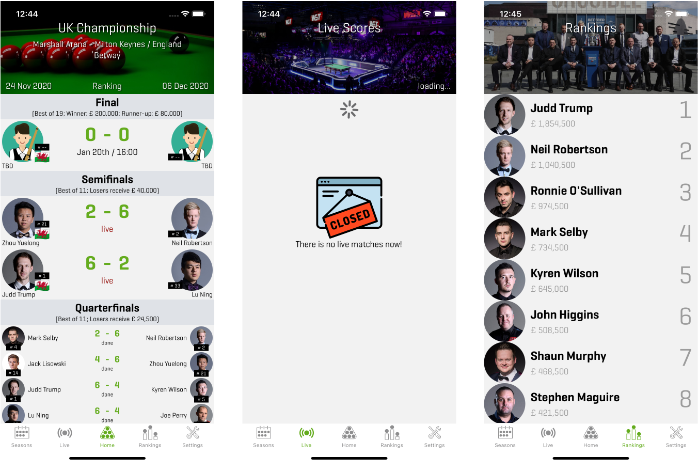
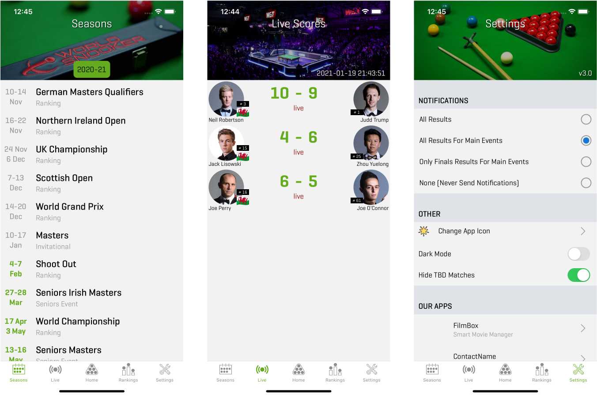
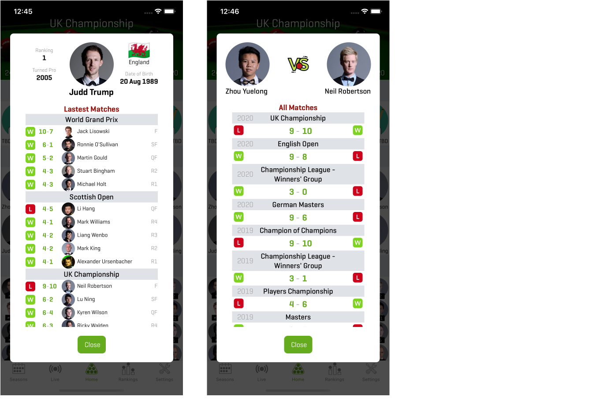

# SnookerApp - React Native App

## Description

Hello, This project is both a TypeScript exercise and a useful application. If you like Snooker like me or want to gain experience in TypeScript, let's develop the application together.

The main screens are as follows.

### ToDo List
- [x] Home Screen
- [x] Home Screen: List Tournament Matches
- [x] Home Screen: Player vs Player Modal Page
- [x] Home Screen: Player Detail Modal Page
- [x] Live Score Screen: Live Version
- [x] Live Score Screen: Offline Version
- [x] Rankings Screen
- [x] Seasons Screen 
- [x] Seasons Screen: Selection of previous seasons  
- [ ] Seasons Screen: Tournament selection from the session list
- [x] Settings Screen
- [ ] Adding country flags 
- [ ] Animation for 'Live' text
- [ ] Dark Theme
- [ ] Hide TBD Matches
- [ ] Notification Settings

### API Documentation
Please note that: The Test API brings limited content. Because this API is for development.

*baseURL:* http://35coders.com/index.php/testapi

- FUNCTION: `tournament`

fullURL: http://35coders.com/index.php/testapi/tournament 

This request returns the currently active tournament information. The event key contains general information about the tournament. The rounds key lists all matches of the tournament linked to rounds. _TestAPI only brings the UK Championship tournament information._

- FUNCTION: `ranks`

fullURL: http://35coders.com/index.php/testapi/ranks 

This request lists the players' scores and positions in the tournament. _TestAPI fetches real ranking information._

- FUNCTION: `live_score`

fullURL: http://35coders.com/index.php/testapi/live_score 

This request returns Ongoing matches. _TestAPI only returns the same 3 matches._

- FUNCTION: `seasons`

fullURL: http://35coders.com/index.php/testapi/seasons 

Gives the season list in descending order. 

- FUNCTION: `seasonEvents`

fullURL: http://35coders.com/index.php/testapi/seasonEvents/year/xxxx 

Returns a list of events in a season. It takes the `year` parameter. Its default value is this year.

- FUNCTION: `pvp`

fullURL: http://35coders.com/index.php/testapi/pvp/p1/12/p2/154

Lists the results of matches between two players. It takes two parameters as `p1` and `p2`. _TestAPI only returns the results of Judd Trump and Neil Robertson._

- FUNCTION: `playerMatches`

fullURL: http://35coders.com/index.php/testapi/playerMatches/playerId/12/

Returns the last 15 matches of the selected player. It takes the `playerId` parameter. _TestAPI only returns the results of Judd Trump._

## Installation

Run yarn to install required packages.
