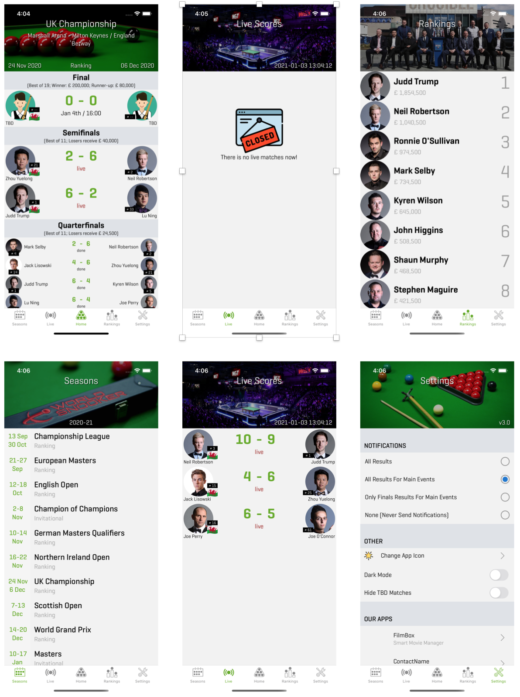

# SnookerApp - React Native App

## Description

Hello, This project is both a TypeScript exercise and a useful application. If you like Snooker like me or want to gain experience in TypeScript, let's develop the application together.

The main screens are as follows.

### ToDo List
- [x] Home Screen
- [x] Live Score Screen
- [x] Rankings Screen
- [x] Seasons Screen 
- [x] Settings Screen
- [ ] Live animation
- [ ] Dark Theme
- [ ] Hide TBD Matches
- [ ] Player Detail Modal Page
- [ ] Player vs Player Modal Page
- [ ] Tournament selection from the session list
- [ ] Selection of previous seasons
- [ ] Notification Settings

## Installation

Run yarn to install required packages.
